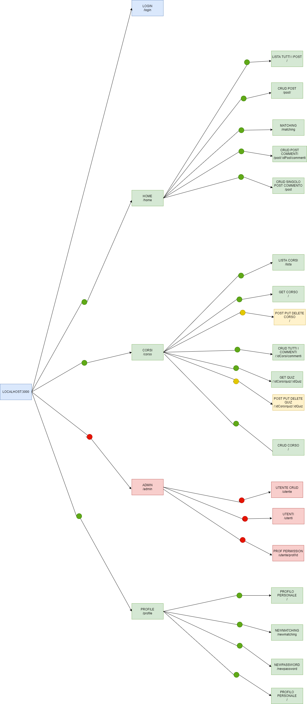

# <h1 align="center">Link-Inim</h1>


Progetto sviluppato perl'hackathon di fine corso.
Migliora la produttività della tua azienda con Link-Inim

### Indice
* 1 [Installazione](#installazione)
* 2 [Guida](#guida)
* 3 [Rotte Backend](#rotte)
* 4 [Software utilizzati](#software)
* 5 [Autori](#autori)

<a name="installazione"></a>
## Installazione
Clonare il progetto su un ambiente di sviluppo o usare il comando seguente tramite prompt dei comandi usando 
```
git clone https://github.com/leandro-fz/Link-Inim
```
Una volta installata si dorà seguire il comando
```
npm install
```
per installare tutte le dipendenze necessarie.
Si dovrà inoltre avviare il database 

<a name="guida"></a>
## Guida
Ci sono tre tipi di utenti nel sistema con tre tipi di privilegi diversi:
|utente|sicurezza|
|-------------------|--|
|dipendente| :green_circle:|
|professore| :yellow_circle:|
|admin     | :red_circle:|


l'admin può accedere a tutte le rotte, il professore solo a quelle gialle e verdi, il dipendente solo a quelle verdi

<a name="rotte"></a>
## Rotte Backend


<a name="software"></a>
## Software utilizzati
* Ambiente di sviluppo : [Visual Studio Code](https://code.visualstudio.com/)
* Software per la gestione di librerie : [npm](https://www.npmjs.com/)
* Backend runtime environment : [Node](https://nodejs.org/it/)
* Framework JS : [Express](https://expressjs.com/it/)
* Ambiente di sviluppo API : [Postman](https://www.postman.com/)
* Mockup graphic platform : [Figma](https://www.figma.com/)
* Task management : [Trello](https://trello.com/)
* Database platform : [MySQL Workbench](https://www.mysql.com/it/products/workbench/)

<a name="autori"></a>
## Autori

|             Autori            |   Linkedin  |
|-------------------------------|:---------:|
| Leandro Falasca Zamponi       |   [link](https://www.linkedin.com/in/leandro-falasca-zamponi/)   |
| Roberto Marchionni            |           |
| Sonia Ascenzi                 |   [link](https://www.linkedin.com/in/soniaascenzi/)   |
| Luca Ardò                     |   [link](https://www.linkedin.com/in/luca-ard%C3%B2-4973a6226/)  |
| Maria Fernanda Fabian Briceno |   [link](https://www.linkedin.com/in/maria-fernanda-fabian-briceno-6429051a2/)  |


